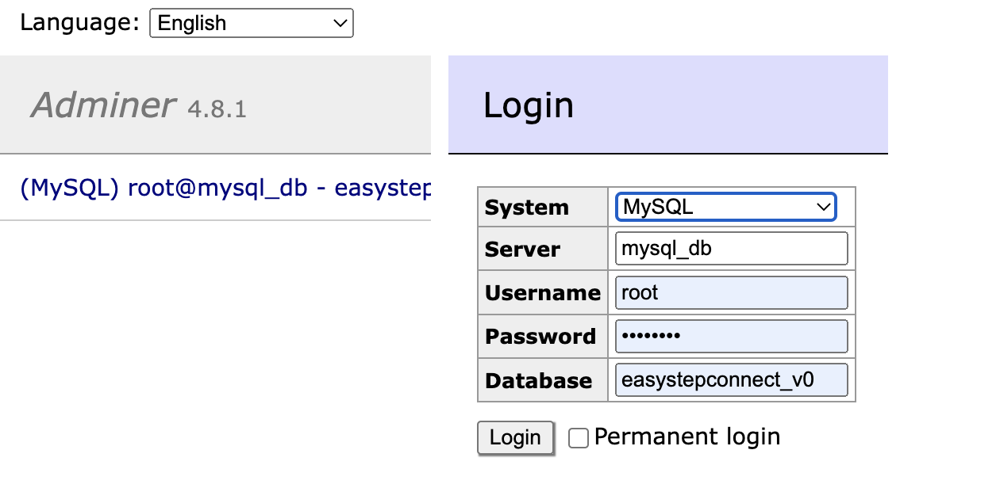

# Easystep Connect

Easystep Connect can be accessed at http://86.119.46.224/

## Setup To Run Locally

### Requirements
[Node.js](https://nodejs.org/) version 16.14 or above is required. Use `node -v` to check the installed version. Installers for Windows and Mac are available at https://nodejs.org/en/download/

[Docker Desktop](https://www.docker.com/products/docker-desktop/) version 4 or above. The version is display at the bottom right of the application.

### Workflow

You'll find a client folder (frontend) with the react-app and the node.js server (backend).

1. Clone this project.
   ```sh
   git clone https://gitlab.fhnw.ch/ip34-<PathToYourProjectDocs>.git <ProjectName>Docs
   ```
2. Open the docker desktop app. You con download it here:

   [Docker Desktop](https://www.docker.com/products/docker-desktop/)


3. In your project terminal run (be aware to be under the easystepconnect dir)
   ```sh
   docker compose build --no-cache
   ```
   and then
   ```sh
   docker compose up -d
   ```
4. After all container started and are running

   1. Open in your browser:
   ```sh
   http://localhost:8000/
   ```
   2. Add the following informations:
   
   ```
   Server: mysql_db
   Username: root
   Password: password
   Database: easystepconnect_v0
   ```


5. To access the client, enter in your browser:

   ```sh
   http://localhost/
   ```

6. To access the server (API), enter in your browser:

   ```sh
   http://localhost:3001/<Your operations>
   ```
7. At the end, you can stop your docker running in the project terminal terminal:
   ```sh
   docker compose down
   ```


### Problem with the setup
If you have a `node: --openssl-legacy-provider is not allowed in NODE_OPTIONS` run in your terminal:


### 👇️ for macOS, Linux or Windows Git Bash
unset NODE_OPTIONS

#### -----------------------------------------

### 👇️ for Windows CMD (Command Prompt)
set NODE_OPTIONS=

#### -----------------------------------------

### 👇️ for Windows PowerShell
[Environment]::SetEnvironmentVariable('NODE_OPTIONS', '', 'User')
[Environment]::SetEnvironmentVariable('NODE_OPTIONS', '', 'Machine')

***Please contact the programmer team if your encounter any problem***


